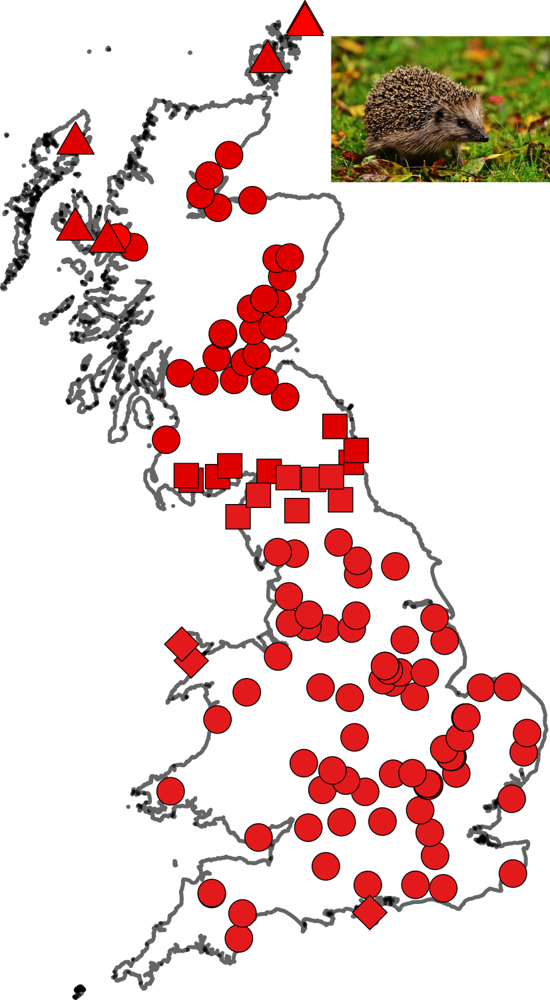
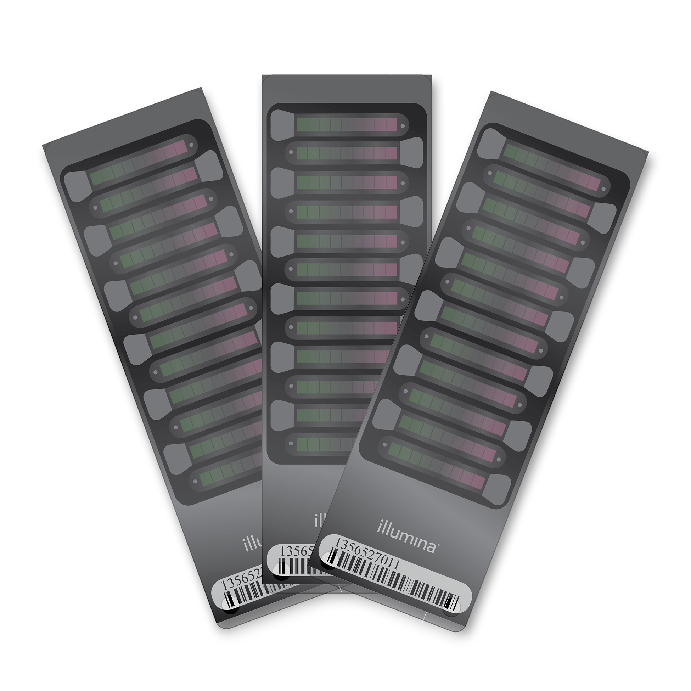
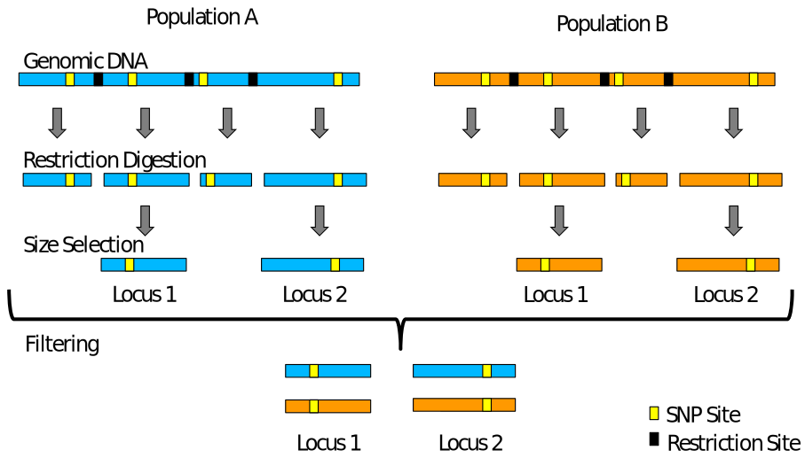
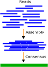
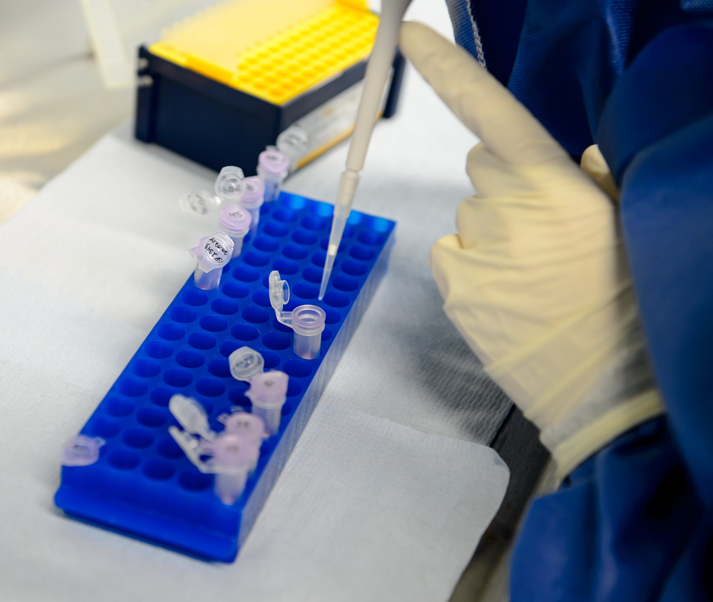
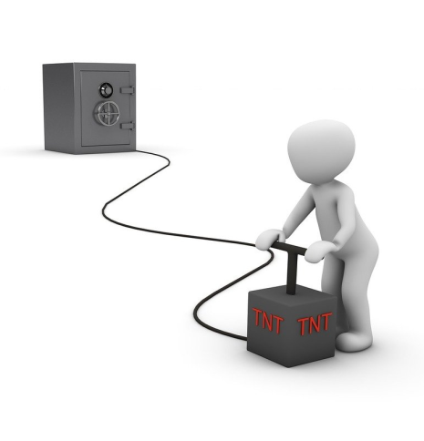

<!-- adding bold and italic options -->

## Conservation Genomics Research

---

## How to design a genomics project

**Planning**

- What is the question?
- What data and coverage?
- Is there a reference genome?

**Running the project**

- Getting samples
- DNA extraction
- Library preparation and sequencing
- Data analysis and storage

**Funding**

- What does it all cost?
- Finding funders

--- .segue .dark 

## Planning

--- &twocol

## What is the question?

*** =left

**Measure genetic variability**

- Individual heterozygosity or inbreeding
- Population level
- Single or multiple populations?

**Identify population structure**

- Do you know where the populations are?
- What is the geographic scale?
- Need multiple individuals per pop

**Test for selection**

- Based on population allele frequencies
- >15 individuals per pop

*** =right

--- &twocol

## What data and coverage?

*** =left

**Genome resequencing**

- You can do everything (except structural variants)
- Individual-based analyses typically require higher coverage
- Can use **genotype likelihoods**
- Measures within or between populations (inc. phylogeny) can use lower coverage
- Highly recyclable and reusable
- Most expensive
- Least lab work

*** =right

--- &twocol

## What data and coverage?

*** =left

**SNP arrays**

- Question depends where the SNPs are
- Can't recover contiguous sequences 
- Can't discover new variants
- Can suffer from **ascertainment bias**
- Development expensive but then cheap and scaleable
- Can't really be integrated with other data types

*** =right

--- &twocol

## What data and coverage?

*** =left

**RADseq**

- No functional analysis
- No inbreeding using ROH
- Phylogenetics tricky
- Cheap sequencing costs but more lab work
- Poor reproducibility
- Can't really be integrated with other data types

*** =right

--- &twocol

## Is there a reference genome?

*** =left

**Yes, fully annotated chromosome level**

- You can do everything

**Yes, but no annotation**

- No functional analysis possible

**Yes, but scaffold level**

- Sex-specific processes and inbreeding using ROHs difficult

**No reference genome**

- Only RADseq

*** =right

--- .segue .dark 

## Running the project

--- &twocol

## Getting samples

*** =left

- Requires a tissue sample
- Swab, skin, hair
- Blood, soft tissue
- Live or dead?
- UK - Home Office Licensable?
- Landowner permission?
- How to find/catch?
- Ethical concerns?
- Tissue export (CITES, Nagoya)

*** =right

--- &twocol

## DNA extraction, library preparation and sequencing

*** =left

**DNA extraction**

- Mostly use commercial kits
- With modification for tissue type
- Minimal lab equipment
- Easy!

**Library prep**

- Easy to outsource
- Running in house a bit cheaper
- Requires large investment/additional kit

**Sequencing**

- Most labs will outsource

*** =right

--- &twocol

## Data analysis and storage

*** =left

- Raw data volume 10x snake:
- Project volume hedgehogs: 4.3 Tb
- Typical mapping run: 20 CPUs, 192 Gb RAM, 3-4 hrs
- HPC running linux OS
- Windows unsupported
- HPC may incur charges
- Hard disk space will be Tb, duplicate backup
- All raw data ends up on public database
- Code published alongside paper
- Requires academic at PhD/postdoc level

*** =right

--- .segue .dark 

## Funding

--- &twocol bg:white

## What does it all cost?

*** =left

**Lab consumables**

- Negligible, few £100's

**Reference genome**

- Minimally 20x coverage PacBio
- 1.5 Gb genome = £3k

**Resequencing**

- Genome * coverage * £9 = total
- 1.6 * 10 * 9 = £144
- 24 * 10 * 9 = £2040

**Staffing**

- Postdoc = £60k per annum

*** =right

--- &twocol

## Finding funders

*** =left

- Research councils
- Governmental departments
- Conservation NGOs
- Commercial companies
- Students!

*** =right

--- &thankyou

## Next time:

Ancient DNA II: museum samples
